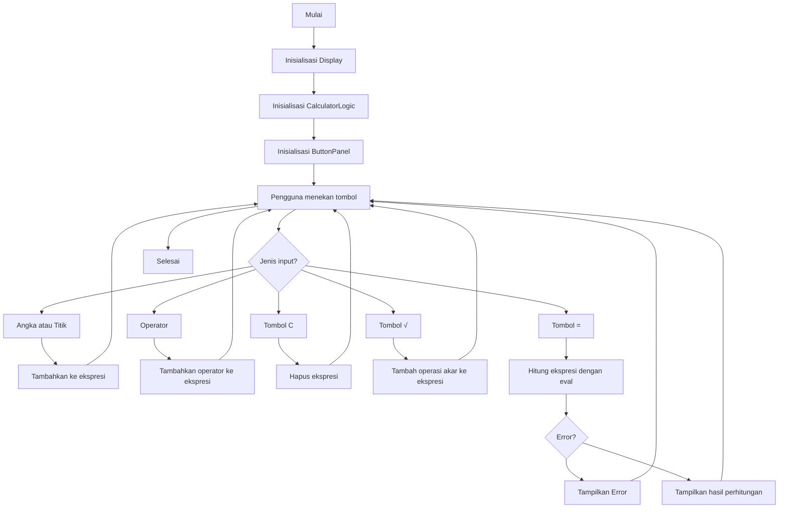

A. Judul Program: Kalkulator sederhana Python

B. Pendahuluan: 1. CalculatorLogic (Model: Pengelola Data dan Aturan)
Ini adalah "otak" dari kalkulator Anda, bertanggung jawab penuh atas semua perhitungan dan manajemen data.
- Fungsi Utama: Bagian ini menyimpan ekspresi matematika yang sedang dikerjakan (self.expression, misalnya "45*2.5+8"). Ia tidak peduli bagaimana ekspresi itu ditampilkan; tugasnya hanya memastikan data disimpan dengan benar.
- Perhitungan Aman: Metode calculate() adalah inti dari fungsionalitas. Ia menggunakan fungsi eval() Python untuk mengevaluasi string ekspresi menjadi hasil numerik. Penggunaan eval() di sini diamankan (dengan {"__builtins__": None}) untuk mencegah kode berbahaya dieksekusi, membatasi fungsionalitas hanya pada operasi matematika.
Pemformatan Internal: Fungsi seperti _format_display mengubah operator internal Python (*, /) menjadi operator yang lebih user-friendly (×, ÷) sebelum mengirimkannya ke tampilan.
Pencegahan Error: Logic ini memiliki mekanisme dasar penanganan kesalahan, terutama untuk ZeroDivisionError (pembagian dengan nol), yang kemudian akan menampilkan pesan "Error" kepada pengguna, bukan menghentikan program.

2. DisplayPanel (View: Tampilan Output)
Ini adalah bagian dari antarmuka pengguna (View) yang menampilkan hasil pekerjaan Logika.
- Fungsi Utama: Menyediakan area baca (menggunakan ctk.CTkEntry dengan state="readonly") di mana pengguna dapat melihat input ekspresi mereka dan hasil perhitungannya.
- Keterhubungan (Callback): Kelas ini dihubungkan ke CalculatorLogic melalui mekanisme callback (self.logic.set_update_callback). Artinya, setiap kali CalculatorLogic memodifikasi self.expression, ia akan - memberi tahu DisplayPanel untuk memperbarui isinya menggunakan metode set().
- Desain: Menggunakan font yang besar dan tebal, serta penempatan di sudut kanan, untuk memastikan ekspresi panjang dan hasil mudah dibaca.

3. ButtonPanel (View: Tampilan Input)
Ini adalah bagian kedua dari antarmuka pengguna (View) yang bertanggung jawab atas input pengguna.
- Fungsi Utama: Menata semua tombol interaktif (angka 0-9, titik, operator +, -, ×, ÷, %, C, (, ), dan =) dalam tata letak 5x4 menggunakan sistem grid.
- Aksi Tombol: Setiap tombol memiliki perintah yang terikat pada metode di CalculatorLogic (misalnya, menekan '7' memanggil self.logic.add_input("7")).
- Desain Visual: Menggunakan skema warna yang membedakan fungsi tombol (Merah untuk Clear, Hijau untuk Equals, Biru untuk Operator, Abu-abu gelap untuk Angka) untuk meningkatkan kegunaan dan estetika.

4. CalculatorApp (Controller: Pengontrol Aliran)
Ini adalah kelas utama yang mengelola inisialisasi, pengaturan, dan aliran kontrol aplikasi (Controller).
- Inisialisasi: Mengatur lingkungan CustomTkinter (mode gelap), membuat jendela utama, dan menyiapkan semua instans komponen (display, logic, buttons).
- Grid Layout: Mengatur pembagian ruang jendela utama: baris atas untuk tampilan, dan sisa baris untuk panel tombol.
- Binding Keyboard: Fungsi yang sangat penting adalah handle_keypress(). Ini memetakan tombol fisik pada keyboard (*, /, Enter, Backspace, Esc) ke fungsi kalkulator yang sesuai, memungkinkan pengguna untuk berinteraksi dengan cepat tanpa mengklik tombol di layar.
- Run: Metode run() memulai mainloop() yang menjaga aplikasi tetap hidup dan responsif terhadap event (klik mouse atau penekanan tombol) hingga pengguna menutupnya.

C. Fitur Utama: 1. Fungsionalitas Inti & Perhitungan
- Operasi Dasar: Mendukung empat operasi aritmatika dasar (Penjumlahan +, Pengurangan -, Perkalian *, Pembagian /) dan Modulus %.
- Perhitungan Akurat: Mampu mengevaluasi ekspresi matematika kompleks yang dimasukkan sebagai string (misalnya, (5 * 2) + 1).
- Penanganan Error: Mampu mendeteksi dan menangani kesalahan umum, seperti pembagian dengan nol (ZeroDivisionError), dengan menampilkan pesan "Error (÷0)" di layar.

2. Antarmuka Pengguna (UI) dan Interaksi
- Desain Modern (CustomTkinter): Menggunakan CustomTkinter untuk menyediakan antarmuka bergaya modern, termasuk mode gelap (ctk.set_appearance_mode("dark")) dan elemen dengan sudut membulat.
- Tombol Interaktif: Menyediakan tata letak tombol 5x4 yang intuitif, termasuk angka 0-9, operator, dan tombol kontrol.
- Visualisasi Operator: Mengubah operator internal Python (*, /) menjadi simbol yang lebih jelas pada tampilan (yaitu, × dan ÷).
- Pemisahan Warna Tombol: Menggunakan skema warna yang berbeda untuk membedakan fungsi tombol (Merah untuk Clear, Hijau untuk Equals, Biru untuk Operator, Abu-abu untuk Angka).

3. Kontrol Input dan Logika
Input Keyboard Penuh: Mendukung penekanan tombol fisik pada keyboard untuk semua input:
- Angka, +, -, *, /.
- Enter atau Return untuk menghitung hasil (=).
- BackSpace untuk menghapus satu karakter.
- Escape (Esc) untuk menghapus seluruh ekspresi (C).
- Pencegahan Operator Ganda: Memiliki logika untuk mencegah ekspresi tidak valid seperti 5++ atau 10// dengan mengganti operator terakhir.
- Kontrol Display: Tampilan input/output diatur sebagai read-only (state="readonly"), mencegah pengguna mengetik teks atau karakter yang tidak valid secara langsung.

4. Arsitektur dan Keterhubungan
- Callback Tampilan: Menggunakan mekanisme callback (set_update_callback) untuk memastikan Logika dan Tampilan terhubung, sehingga setiap perubahan ekspresi segera diperbarui di layar secara real-time.
- Struktur Modular: Kode dibagi menjadi kelas-kelas terpisah (Logic, Display, Button, App) yang memisahkan tanggung jawab (Logika dari Tampilan), sehingga kode lebih mudah dikelola dan diperluas.

D. Panduan Instalasi: Langkah-langkah untuk mengunduh dan menyiapkan program.
Panduan Instalasi Kalkulator Python dari GitHub
Panduan ini menjelaskan proses penyiapan proyek Python dari GitHub, mengasumsikan Anda memiliki Git dan Python 3.x yang sudah terinstal.

1. Mengunduh Repositori (Git Clone)
Langkah pertama adalah mendapatkan salinan lengkap dari kode proyek tersebut dari platform GitHub ke komputer lokal Anda.

Penjelasan Detail:

git clone: Ini adalah perintah dasar dalam Git yang berfungsi untuk menyalin repositori yang ada (misalnya, di GitHub) ke direktori lokal baru.

URL Repositori: Anda perlu mengganti https://github.com/username/nama-repo-kalkulator.git dengan alamat yang benar. Alamat ini biasanya ditemukan di tombol "Code" pada halaman utama repositori GitHub.

cd nama-repo-kalkulator: Setelah proses clone selesai, Git akan membuat folder baru sesuai nama repositori. Perintah cd (Change Directory) digunakan untuk masuk ke folder proyek tersebut, di mana semua operasi instalasi berikutnya akan dilakukan.

Perintah: git clone https://github.com/Wil-isLearning/Tugas-Kelompok-1-Kelas-F

2. Membuat dan Mengaktifkan Lingkungan Virtual (Opsional, Sangat Disarankan)
Penggunaan Lingkungan Virtual (Virtual Environment) adalah praktik terbaik dalam pengembangan Python. Tujuannya adalah untuk mengisolasi dependensi proyek ini dari proyek Python lain di sistem Anda dan menjaga sistem global Python tetap bersih.

Penjelasan Detail:

python -m venv venv: Perintah ini menggunakan modul venv bawaan Python untuk membuat lingkungan virtual. Kata venv yang kedua adalah nama folder yang akan dibuat (Anda bisa menggantinya, tetapi venv adalah konvensi umum).

Aktivasi: Setelah lingkungan dibuat, Anda harus mengaktifkannya. Aktivasi akan memastikan bahwa setiap perintah Python atau pip yang Anda jalankan hanya berlaku di dalam lingkungan yang terisolasi ini.

Sistem operasi berbasis Unix (Linux/macOS) menggunakan skrip aktivasi yang dipanggil dengan source.

Windows (Command Prompt/PowerShell) menggunakan skrip yang dieksekusi langsung.

Indikator: Setelah aktif, Anda akan melihat teks (venv) muncul di awal prompt terminal Anda.

Perintah: python -m venv venv

Untuk Linux atau macOS (Bash/Zsh): source venv/bin/activate

Untuk Windows (Command Prompt atau PowerShell): .\venv\Scripts\activate

3. Menginstal Dependensi (Library)
Proyek Python yang kompleks biasanya memerlukan library tambahan (dependensi) di luar standar Python. Dependensi ini didaftar dalam file bernama requirements.txt.

Penjelasan Detail:

requirements.txt: File ini berisi daftar nama dan versi spesifik dari semua library Python yang dibutuhkan agar proyek kalkulator dapat berjalan dengan benar (misalnya, jika kalkulator menggunakan library Tkinter untuk GUI atau Numpy untuk operasi matematika lanjutan).

pip install -r requirements.txt: Perintah ini memberitahu pip (Package Installer for Python) untuk membaca daftar library dari file requirements.txt (-r berarti requirements) dan menginstalnya secara otomatis ke dalam lingkungan virtual yang sudah aktif.

Perintah: pip install -r requirements.txt

4. Menjalankan Program
Ini adalah langkah terakhir, yaitu menjalankan skrip Python utama yang berisi logika kalkulator.

Penjelasan Detail:

python kalkulator.py: Perintah python akan menjalankan skrip yang ditentukan. Anda harus memastikan bahwa Anda menggunakan nama file yang benar dari repositori tersebut. Nama file umum adalah main.py, app.py, atau, dalam contoh ini, kalkulator.py.

Output: Setelah perintah dijalankan, program kalkulator akan mulai berinteraksi dengan Anda, entah sebagai program baris perintah (konsol) yang meminta input angka, atau sebagai jendela aplikasi grafis (GUI) jika proyek tersebut menyediakannya.

Perintah: python kalkulator.py

E. Panduan Menjalankan: Perintah untuk menjalankan / konfigurasi program.
Panduan Menjalankan Program: Kalkulator Sederhana Python
Panduan ini berisi langkah-langkah untuk mengeksekusi dan berinteraksi dengan program Kalkulator Sederhana Python setelah semua langkah penyiapan telah selesai.

1. Verifikasi Lingkungan Kerja
Pastikan terminal Anda siap untuk menjalankan program dengan benar.

Detail:

Direktori Proyek: Anda harus berada di dalam folder proyek Kalkulator Sederhana Python di terminal Anda.

Lingkungan Virtual: Lingkungan virtual harus aktif. Ini ditandai dengan munculnya (venv) di awal prompt terminal. Jika tidak ada, Anda perlu mengaktifkannya.

Perintah untuk Mengaktifkan (Jika Belum Aktif):

Untuk Sistem Linux atau macOS: source venv/bin/activate

Untuk Sistem Windows: .\venv\Scripts\activate

2. Perintah Eksekusi Program
Gunakan perintah dasar Python untuk memulai program.

Detail:

Identifikasi File Utama: Asumsikan file entry point (titik masuk) program Kalkulator Sederhana Python adalah kalkulator.py atau main.py.

Eksekusi: Panggil interpreter Python untuk menjalankan script.

Perintah untuk Menjalankan: python kalkulator.py

Jika Anda yakin nama file utamanya berbeda, ganti kalkulator.py dengan nama file yang sesuai.

3. Interaksi dengan Kalkulator Sederhana Python
Setelah perintah eksekusi berhasil, program akan mulai berjalan.

Detail Interaksi:

Kalkulator Konsol: Jika Kalkulator Sederhana Python berjalan di terminal, program akan menampilkan pesan (misalnya, "Masukkan operasi:") dan menunggu input Anda. Anda cukup mengetikkan perhitungan (contoh: 5 * 8) dan menekan Enter untuk melihat hasilnya.

Kalkulator GUI: Jika program ini memiliki antarmuka grafis (walaupun sederhana), jendela baru akan muncul di layar. Interaksi dilakukan melalui klik mouse pada tombol-tombol di jendela tersebut.

4. Pengakhiran Sesi Kerja
Setelah selesai menggunakan Kalkulator Sederhana Python, Anda perlu menghentikan program dan keluar dari lingkungan kerja.

Detail Pengakhiran:

Menghentikan Program: Untuk program yang berjalan terus menerus di konsol, tekan Ctrl + C. Untuk program GUI, tutup jendelanya.

Menonaktifkan venv: Pindah kembali ke lingkungan terminal sistem normal Anda.

Perintah Menonaktifkan Lingkungan Virtual: deactivate

F. Dokumentasi Teknis: Rancangan sistem menggunakan diagram flowchart disertai penjelasan

Flowchart program dalam format mermaid.

G. Daftar Kontributor (Tabel): Nama, NIM, Link Agun git masing-masing anggota kelompok yang mengerjakan.

daftar tabel
| Nama Anggota | NIM | Link Akun Github |
|--------------|------|------------------|
| Wilson Doringin (Project Maintainer) | 250211060115 | https://github.com/Wil-isLearning |
| Rey Jeheskiel Tumurang | 250211060071 | https://github.com/rey27-zx |
| Brian Junianto Kabo | 250211060032 | https://github.com/briankabo |

link repository kami
| Link Repository | https://github.com/Wil-isLearning/Tugas-Kelompok-1-Kelas-F |

