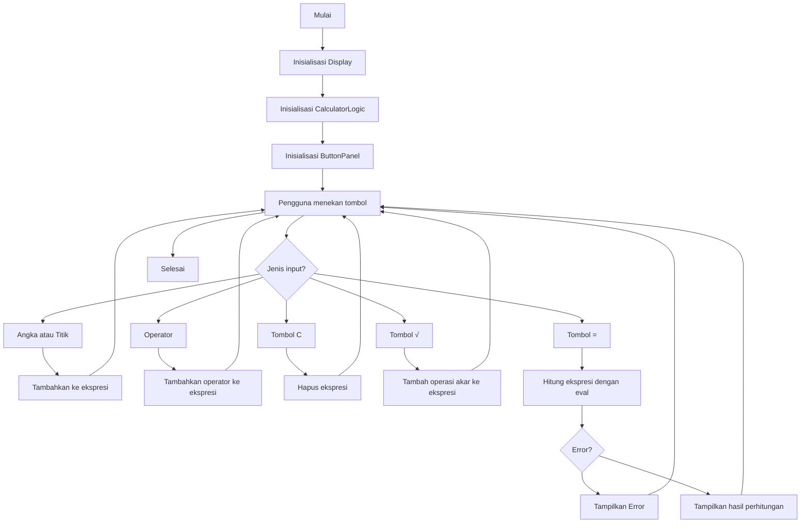

A. Judul Program: Kalkulator sederhana Python

B. Pendahuluan: 1. CalculatorLogic (Model: Pengelola Data dan Aturan)
Ini adalah "otak" dari kalkulator Anda, bertanggung jawab penuh atas semua perhitungan dan manajemen data.
- Fungsi Utama: Bagian ini menyimpan ekspresi matematika yang sedang dikerjakan (self.expression, misalnya "45*2.5+8"). Ia tidak peduli bagaimana ekspresi itu ditampilkan; tugasnya hanya memastikan data disimpan dengan benar.
- Perhitungan Aman: Metode calculate() adalah inti dari fungsionalitas. Ia menggunakan fungsi eval() Python untuk mengevaluasi string ekspresi menjadi hasil numerik. Penggunaan eval() di sini diamankan (dengan {"__builtins__": None}) untuk mencegah kode berbahaya dieksekusi, membatasi fungsionalitas hanya pada operasi matematika.
Pemformatan Internal: Fungsi seperti _format_display mengubah operator internal Python (*, /) menjadi operator yang lebih user-friendly (×, ÷) sebelum mengirimkannya ke tampilan.
Pencegahan Error: Logic ini memiliki mekanisme dasar penanganan kesalahan, terutama untuk ZeroDivisionError (pembagian dengan nol), yang kemudian akan menampilkan pesan "Error" kepada pengguna, bukan menghentikan program.

2. DisplayPanel (View: Tampilan Output)
Ini adalah bagian dari antarmuka pengguna (View) yang menampilkan hasil pekerjaan Logika.
- Fungsi Utama: Menyediakan area baca (menggunakan ctk.CTkEntry dengan state="readonly") di mana pengguna dapat melihat input ekspresi mereka dan hasil perhitungannya.
- Keterhubungan (Callback): Kelas ini dihubungkan ke CalculatorLogic melalui mekanisme callback (self.logic.set_update_callback). Artinya, setiap kali CalculatorLogic memodifikasi self.expression, ia akan - memberi tahu DisplayPanel untuk memperbarui isinya menggunakan metode set().
- Desain: Menggunakan font yang besar dan tebal, serta penempatan di sudut kanan, untuk memastikan ekspresi panjang dan hasil mudah dibaca.

3. ButtonPanel (View: Tampilan Input)
Ini adalah bagian kedua dari antarmuka pengguna (View) yang bertanggung jawab atas input pengguna.
- Fungsi Utama: Menata semua tombol interaktif (angka 0-9, titik, operator +, -, ×, ÷, %, C, (, ), dan =) dalam tata letak 5x4 menggunakan sistem grid.
- Aksi Tombol: Setiap tombol memiliki perintah yang terikat pada metode di CalculatorLogic (misalnya, menekan '7' memanggil self.logic.add_input("7")).
- Desain Visual: Menggunakan skema warna yang membedakan fungsi tombol (Merah untuk Clear, Hijau untuk Equals, Biru untuk Operator, Abu-abu gelap untuk Angka) untuk meningkatkan kegunaan dan estetika.

4. CalculatorApp (Controller: Pengontrol Aliran)
Ini adalah kelas utama yang mengelola inisialisasi, pengaturan, dan aliran kontrol aplikasi (Controller).
- Inisialisasi: Mengatur lingkungan CustomTkinter (mode gelap), membuat jendela utama, dan menyiapkan semua instans komponen (display, logic, buttons).
- Grid Layout: Mengatur pembagian ruang jendela utama: baris atas untuk tampilan, dan sisa baris untuk panel tombol.
- Binding Keyboard: Fungsi yang sangat penting adalah handle_keypress(). Ini memetakan tombol fisik pada keyboard (*, /, Enter, Backspace, Esc) ke fungsi kalkulator yang sesuai, memungkinkan pengguna untuk berinteraksi dengan cepat tanpa mengklik tombol di layar.
- Run: Metode run() memulai mainloop() yang menjaga aplikasi tetap hidup dan responsif terhadap event (klik mouse atau penekanan tombol) hingga pengguna menutupnya.

C. Fitur Utama: 1. Fungsionalitas Inti & Perhitungan
- Operasi Dasar: Mendukung empat operasi aritmatika dasar (Penjumlahan +, Pengurangan -, Perkalian *, Pembagian /) dan Modulus %.
- Perhitungan Akurat: Mampu mengevaluasi ekspresi matematika kompleks yang dimasukkan sebagai string (misalnya, (5 * 2) + 1).
- Penanganan Error: Mampu mendeteksi dan menangani kesalahan umum, seperti pembagian dengan nol (ZeroDivisionError), dengan menampilkan pesan "Error (÷0)" di layar.

2. Antarmuka Pengguna (UI) dan Interaksi
- Desain Modern (CustomTkinter): Menggunakan CustomTkinter untuk menyediakan antarmuka bergaya modern, termasuk mode gelap (ctk.set_appearance_mode("dark")) dan elemen dengan sudut membulat.
- Tombol Interaktif: Menyediakan tata letak tombol 5x4 yang intuitif, termasuk angka 0-9, operator, dan tombol kontrol.
- Visualisasi Operator: Mengubah operator internal Python (*, /) menjadi simbol yang lebih jelas pada tampilan (yaitu, × dan ÷).
- Pemisahan Warna Tombol: Menggunakan skema warna yang berbeda untuk membedakan fungsi tombol (Merah untuk Clear, Hijau untuk Equals, Biru untuk Operator, Abu-abu untuk Angka).

3. Kontrol Input dan Logika
Input Keyboard Penuh: Mendukung penekanan tombol fisik pada keyboard untuk semua input:
- Angka, +, -, *, /.
- Enter atau Return untuk menghitung hasil (=).
- BackSpace untuk menghapus satu karakter.
- Escape (Esc) untuk menghapus seluruh ekspresi (C).
- Pencegahan Operator Ganda: Memiliki logika untuk mencegah ekspresi tidak valid seperti 5++ atau 10// dengan mengganti operator terakhir.
- Kontrol Display: Tampilan input/output diatur sebagai read-only (state="readonly"), mencegah pengguna mengetik teks atau karakter yang tidak valid secara langsung.

4. Arsitektur dan Keterhubungan
- Callback Tampilan: Menggunakan mekanisme callback (set_update_callback) untuk memastikan Logika dan Tampilan terhubung, sehingga setiap perubahan ekspresi segera diperbarui di layar secara real-time.
- Struktur Modular: Kode dibagi menjadi kelas-kelas terpisah (Logic, Display, Button, App) yang memisahkan tanggung jawab (Logika dari Tampilan), sehingga kode lebih mudah dikelola dan diperluas.

D. Panduan Instalasi: Langkah-langkah untuk mengunduh dan menyiapkan program (misal: git clone, install library). 

E. Panduan Menjalankan: Perintah untuk menjalankan / konfigurasi program (misal: python app.py).

F. Dokumentasi Teknis: Rancangan sistem menggunakan diagram flowchart disertai penjelasan

Flowchart program dalam format mermaid.

G. Daftar Kontributor (Tabel): Nama, NIM, Link Agun git masing-masing anggota kelompok yang mengerjakan.

daftar tabel
| Nama Anggota | NIM | Link Akun Github |
|--------------|------|------------------|
| Wilson Doringin (Project Maintainer) | 250211060115 | https://github.com/Wil-isLearning |
| Rey Jeheskiel Tumurang | 250211060071 | https://github.com/rey27-zx |
| Brian Junianto Kabo | 250211060032 | https://github.com/briankabo |

link repository kami
| Link Repository | https://github.com/Wil-isLearning/Tugas-Kelompok-1-Kelas-F |

