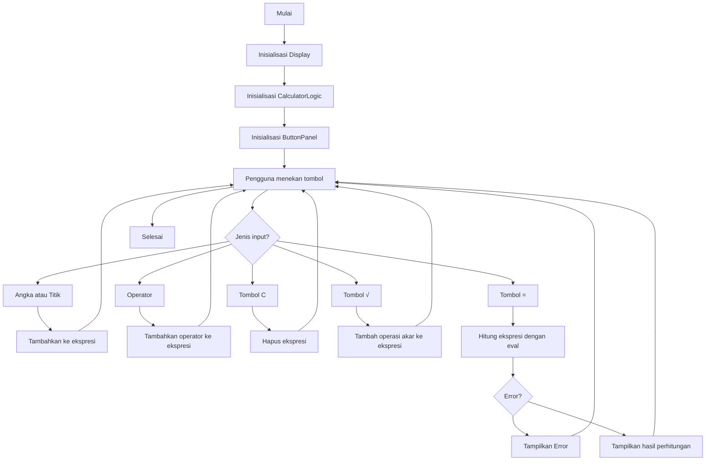

A. Judul Program: Nama aplikasi yang jelas.

B. Pendahuluan: Memberikan gambaran umum tentang perangkat lunak dan Penjelasan mengenai apa fungsi program tersebut.

C. Fitur Utama: Daftar fitur yang dimiliki program.

D. Panduan Instalasi: Langkah-langkah untuk mengunduh dan menyiapkan program (misal: git clone, install library). 

E. Panduan Menjalankan: Perintah untuk menjalankan / konfigurasi program (misal: python app.py).

F. Dokumentasi Teknis: Rancangan sistem menggunakan diagram flowchart disertai penjelasan

Flowchart program dalam format mermaid.

G. Daftar Kontributor (Tabel): Nama, NIM, Link Agun git masing-masing anggota kelompok yang mengerjakan.

daftar tabel
| Nama Anggota | NIM | Link Akun Github |
|--------------|------|------------------|
| Wilson Doringin (Project Maintainer) | 250211060115 | https://github.com/Wil-isLearning |
| Rey Jeheskiel Tumurang | 250211060071 | https://github.com/rey27-zx |
| Brian Junianto Kabo | 250211060032 | https://github.com/briankabo |

link repository kami
| Link Repository | https://github.com/Wil-isLearning/Tugas-Kelompok-1-Kelas-F |

